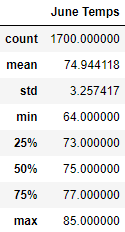
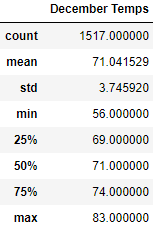
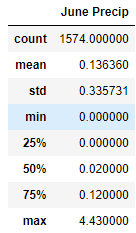
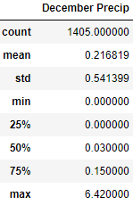

# Advanced Data Storage and Retrieval

## Overview of the analysis

Client wants more information about temperature trends before opening the surf shop. Specifically, client wants temperature data for the months of June and December in Oahu, in order to determine if the surf and ice cream shop business is sustainable year-round.

Assignment consists of two technical analysis deliverables and a written report. Submit the following:

- Deliverable 1: Determine the Summary Statistics for June
- Deliverable 2: Determine the Summary Statistics for December
- Deliverable 3: A written report for the statistical analysis (README.md)

## Results

- There is a bulleted list that addresses the three key differences in weather between June and December.
-  
- The mean of the data for June is 75 degrees compared to December at 71 degree. A difference of -4 degrees.
- The max temp are 85 degrees for June and 83 degrees for December. A difference of -2 degrees.
- The minimum temp are 73 degrees for June and 56 degrees for December. A difference of  -17 degrees.
- Data sets are not identical due to fewer data points for December months.

## Summary

- There is a high-level summary of the results and there are two additional queries to perform to gather more weather data for June and December.
  - Overall the temperature differences between June and December are negligible. A 4 degree difference would have a negligible effect on ice cream sales and surfing activities.
  -   
  - When adding precipitation data to the analysis the mean rainfall is .14 for June and .22 for December. This is a difference of .08 inches. This amount is again negligible. December does have more precipitation, but the amount is still relatively low.

